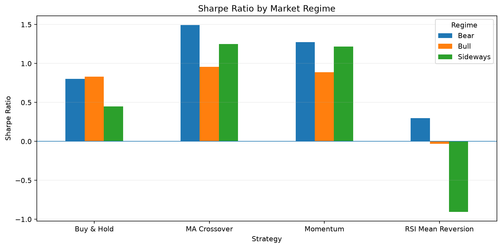
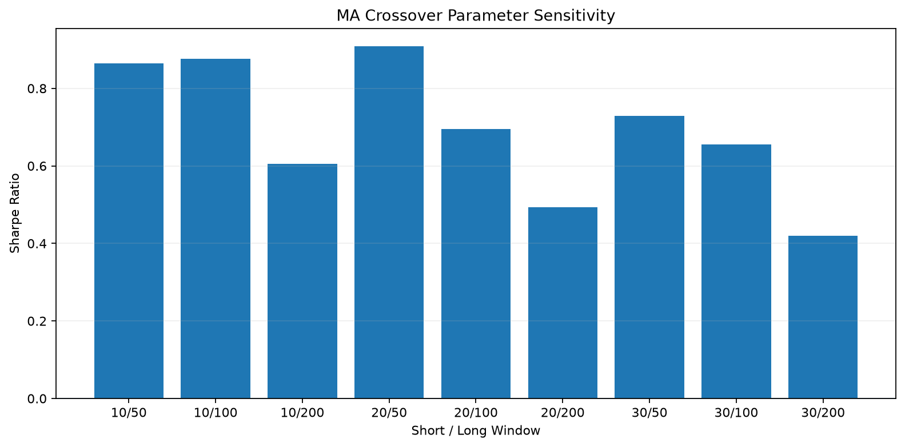
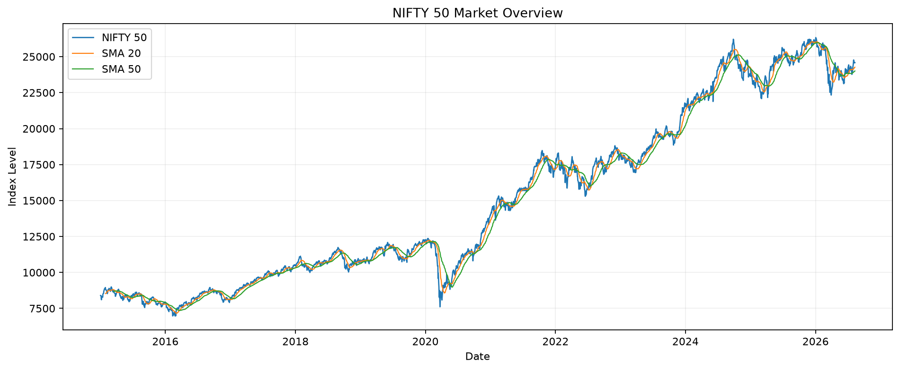
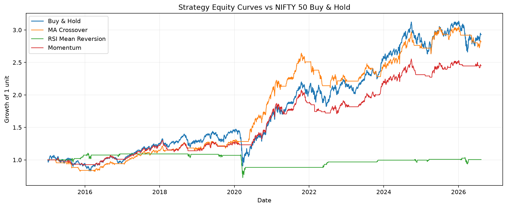
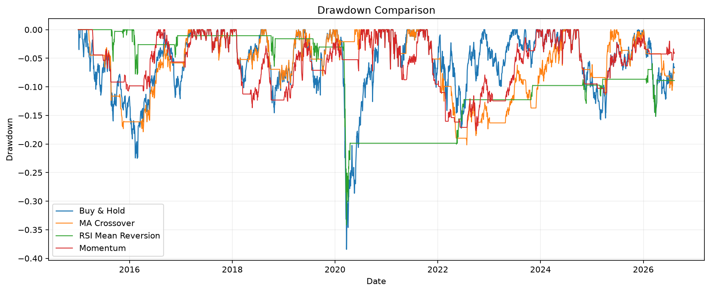

# Quantitative Trading Strategy & Backtesting System

A Python-based research project for evaluating simple systematic trading strategies on historical NIFTY 50 data.

The project focuses on research discipline rather than prediction claims: clean market data, transparent signal rules, no look-ahead bias, transaction costs, benchmark comparison, regime analysis, and parameter sensitivity.

## Project Objective

The goal is to test whether simple trend-following, mean-reversion, and momentum rules can improve risk-adjusted performance relative to a NIFTY 50 Buy & Hold benchmark.

## Dataset

- Market: NIFTY 50 (`^NSEI`)
- Frequency: Daily
- Period: 2015-01-02 to 2026-08-10
- Observations: 2,856 trading days
- Source: Yahoo Finance via `yfinance`
- Fields: Open, High, Low, Close, Adjusted Close, Volume

Raw downloaded data is cached locally under `data/raw/` and is excluded from Git because the project can reproduce it automatically.

## Research Flow

```text
Historical NIFTY 50 Data
        ↓
Validation & Cleaning
        ↓
Feature Engineering
        ↓
Trading Signals
        ↓
Next-Day Positions
        ↓
Backtesting
        ↓
Transaction Costs
        ↓
Risk & Performance Metrics
        ↓
Benchmark Comparison
        ↓
Market Regimes
        ↓
Parameter & Cost Sensitivity
```

## Strategies

### 1. Moving Average Crossover
A trend-following strategy using a 20-day short moving average and 50-day long moving average.

- Long when SMA 20 > SMA 50
- Flat otherwise

### 2. RSI Mean Reversion
A long-only mean-reversion strategy.

- Enter when RSI(14) falls below 30
- Exit after RSI recovers above 50

### 3. Momentum
A simple long-only momentum rule.

- Uses 60-day price momentum
- Long when recent momentum is positive
- Flat otherwise

## Backtesting Methodology

The backtester is shared across all three strategies.

Important implementation choices:

- Signals are calculated from information available at the close.
- Positions are shifted by one trading day before returns are earned.
- This prevents a signal based on today's close from earning today's return.
- Transaction costs are charged when the executed position changes.
- Default cost assumption: 0.05% per position change.
- All strategies are compared with NIFTY 50 Buy & Hold.

## Performance Metrics

The project calculates:

- Total Return
- CAGR
- Annualized Volatility
- Sharpe Ratio
- Maximum Drawdown
- Calmar Ratio
- Number of Trades
- Win Rate
- Average Trade Return
- Average Winner
- Average Loser
- Profit Factor

## Main Results

| Strategy | Total Return | CAGR | Sharpe Ratio | Max Drawdown | Trades |
|---|---:|---:|---:|---:|---:|
| Buy & Hold | 192.82% | 9.94% | 0.67 | -38.44% | — |
| MA Crossover | 181.76% | 9.57% | **0.91** | -20.17% | 26 |
| RSI Mean Reversion | 0.55% | 0.05% | 0.05 | -34.16% | 15 |
| Momentum | 144.99% | 8.23% | 0.84 | **-17.68%** | 59 |

### What stands out

- Buy & Hold produced the highest absolute return over the sample.
- MA Crossover produced the highest risk-adjusted return among the tested strategies.
- Momentum had the lowest maximum drawdown.
- RSI Mean Reversion had a high trade win rate but weak overall performance, showing why win rate alone is not enough to evaluate a strategy.
- Both MA Crossover and Momentum substantially reduced drawdown relative to Buy & Hold.

## Market Regime Analysis

Market conditions are classified using price relative to the 200-day moving average:

- **Bull:** Close > SMA 200 by more than 2%
- **Bear:** Close < SMA 200 by more than 2%
- **Sideways:** between those thresholds

The regime label is shifted by one day when evaluating returns so that regime analysis also avoids look-ahead bias.

The results show that strategy behaviour changes meaningfully across regimes. Trend-following and momentum strategies were more consistent across market conditions, while RSI mean reversion was much less stable.



## Parameter Sensitivity

The Moving Average strategy was tested across:

- Short windows: 10, 20, 30 days
- Long windows: 50, 100, 200 days

The purpose is not to select the single best historical combination. Instead, the test checks whether performance remains reasonable across nearby parameter choices.

The 20/50 combination delivered the strongest Sharpe ratio among the tested pairs, while several other combinations also produced positive risk-adjusted performance.



## Transaction Cost Sensitivity

The three strategies are also tested under multiple transaction-cost assumptions:

- 0.00%
- 0.025%
- 0.05%
- 0.10%

This helps check whether a strategy depends on unrealistically low trading costs.

Results are saved to:

```text
results/transaction_cost_sensitivity.csv
```

## Visualizations

### Market Overview



### Equity Curve Comparison



### Drawdown Comparison



## Repository Structure

```text
quantitative-trading-backtesting/
│
├── README.md
├── requirements.txt
├── .gitignore
├── main.py
│
├── notebooks/
│   └── 01_quantitative_trading_research.ipynb
│
├── src/
│   ├── __init__.py
│   ├── config.py
│   ├── data_loader.py
│   ├── indicators.py
│   ├── strategies.py
│   ├── backtester.py
│   ├── metrics.py
│   ├── regimes.py
│   └── visualization.py
│
├── data/
│   └── raw/
│
├── results/
│   ├── strategy_comparison.csv
│   ├── regime_performance.csv
│   ├── parameter_sensitivity.csv
│   └── transaction_cost_sensitivity.csv
│
└── images/
    ├── market_overview.png
    ├── equity_curve_comparison.png
    ├── drawdown_comparison.png
    ├── regime_performance.png
    └── parameter_sensitivity.png
```

## Installation

Create and activate a virtual environment, then install dependencies:

```bash
python -m venv .venv
```

Windows PowerShell:

```powershell
.venv\Scripts\Activate.ps1
```

Install packages:

```bash
python -m pip install -r requirements.txt
```

## Run the Project

From the repository root:

```bash
python main.py
```

This downloads the latest configured historical data, runs the strategies and analysis, and regenerates the main result files and charts.

The research notebook can also be opened in VS Code or Jupyter:

```text
notebooks/01_quantitative_trading_research.ipynb
```

## Limitations

- This is a historical backtest, not evidence of future profitability.
- The strategies are long-only and do not model futures leverage or margin.
- Transaction costs are simplified and do not model variable slippage or market impact.
- Yahoo Finance data is suitable for research but is not an exchange-grade institutional data feed.
- Parameter sensitivity reduces but does not eliminate overfitting risk.
- Taxes, brokerage structure, bid-ask spread variation, and execution latency are not explicitly modeled.
- The Sharpe ratio is calculated without subtracting a risk-free rate.

## Future Improvements

Possible extensions include:

- walk-forward evaluation;
- volatility-adjusted position sizing;
- rolling Sharpe analysis;
- more detailed execution-cost modeling;
- out-of-sample testing;
- futures-specific contract and rollover handling.

## Disclaimer

This project is for educational and quantitative research purposes only. It is not investment advice and should not be interpreted as a recommendation to trade any strategy or financial instrument.
